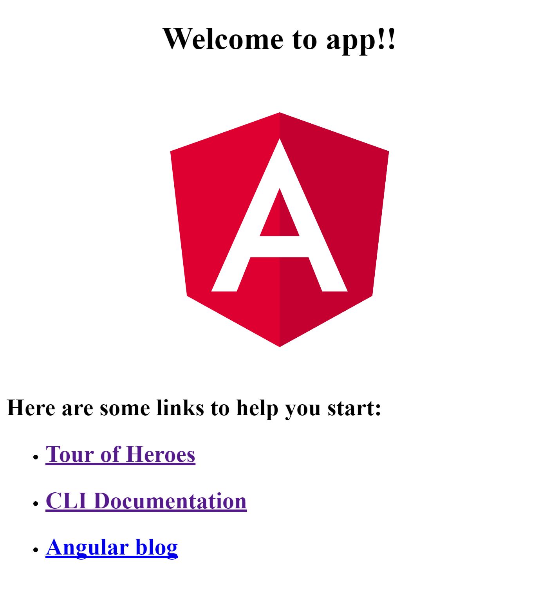
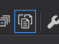
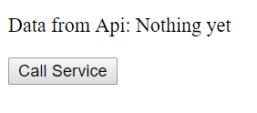
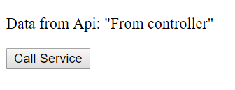

Angular 4 & OWIN Web Api

1. Create VS Project
    1. New Project - ASP.Net Web Application (.Net Framework) - Name: ng4Owin
    2. Template: Empty

2. Add OWIN
    1. Add NuGet Package: Microsoft.Owin.Host.SystemWeb
    2. Add New Item - OWIN Startup class - Name: Startup.cs
        ```csharp
        using Owin;

        namespace ng4Owin
        {
            public class Startup
            {
                public void Configuration(IAppBuilder app)
                {
                    app.Run(context => {
                        context.Response.ContentType = "text/plain";
                        return context.Response.WriteAsync("OWIN here!");
                    });
                }
            }
        }
        ```
    3. Run and test by hitting **F5**. The default browser should open in "http://localhost:60478/" (60478 is a generated random port) and display:
        ```
        OWIN here!
        ```

3. Add Web Api
    1. Add Nuget Package: Microsoft.AspNet.WebApi.Owin
    2. Add Web Api Middleware and configure routes in *Startup.cs*:
        ```csharp
        using Owin;
        using System.Web.Http;

        namespace ng4Owin
        {
            public class Startup
            {
                public void Configuration(IAppBuilder app)
                {
                    var apiConfig = new HttpConfiguration();
                    apiConfig.Routes.MapHttpRoute("default", "api/{controller}/{action}");
                    app.UseWebApi(apiConfig);

                    
                    app.Run(context => {
                        context.Response.ContentType = "text/plain";
                        return context.Response.WriteAsync("OWIN here!");
                    });
                }
            }
        }
        ```
    3. Create an Api controller
        1. (optional) Create a project folder called Controllers
        2. Add - Controller... - Web Api 2 Controller - Empty - Controller Name: SimpleController
        3. Add action to controller, in *SimpleController.cs*
            ```csharp
            using System.Web.Http;

            namespace ng4Owin.Controllers
            {
                public class SimpleController : ApiController
                {
                    public string Get()
                    {
                        return "From controller";
                    }
                }
            }
            ```
        4. Run and test by hittin **F5**. The default browser should open, as before, but, now, add the controller action to the path, i.e., "http://localhost:60478/api/Simple/Get", and the following shoudl display:
            ```
            From controller
            ```
            
            *Note*: There might be some wrapping on the browser display, depending on the accept sent by the browser. E.g, Firefox displays ```<string>From controller</string>``` and Edge displays ```"From controller"```
        
4. Add Static Files Support
    1. NuGet Package: Microsoft.Owin.StaticFiles
    2. Add Static Files Middleware and configura root path in *Startup.cs*:
        ```csharp
        using Microsoft.Owin.FileSystems;
        using Microsoft.Owin.StaticFiles;
        using Owin;
        using System.Web.Http;

        namespace ng4Owin
        {
            public class Startup
            {
                public void Configuration(IAppBuilder app)
                {
                    var apiConfig = new HttpConfiguration();
                    apiConfig.Routes.MapHttpRoute("default", "api/{controller}/{action}");
                    app.UseWebApi(apiConfig);

                    var fileSystem = new PhysicalFileSystem("wwwroot");
                    var staticFilesConfig = new FileServerOptions
                    {
                        FileSystem = fileSystem
                    };
                    app.Run(context => {
                        context.Response.ContentType = "text/plain";
                        return context.Response.WriteAsync("OWIN here!");
                    });
                }
            }
        }
        ```
    3. Change ```web.config``` to use OWIN Handler
        ```xml
        <?xml version="1.0"?>
        <configuration>
        <system.webServer>
            <handlers>
            <clear/>
            <add name="Owin" verb="" path="*" type="Microsoft.Owin.Host.SystemWeb.OwinHttpHandler, Microsoft.Owin.Host.SystemWeb"/>
            </handlers>
        </system.webServer>
        <runtime>
            <assemblyBinding xmlns="urn:schemas-microsoft-com:asm.v1">
            <dependentAssembly>
                <assemblyIdentity name="Microsoft.Owin" publicKeyToken="31bf3856ad364e35" culture="neutral" />
                <bindingRedirect oldVersion="0.0.0.0-3.1.0.0" newVersion="3.1.0.0" />
            </dependentAssembly>
            </assemblyBinding>
        </runtime>
        <system.web>
            <compilation debug="true"/>
        </system.web>
        </configuration>
        ```
    4. Create ```wwwroot``` folder
    5. Add test file
        1. Add - New Item... - Text File - Name: test.txt
            ```
            Static content
            ```
    6. Run and test by hittin **F5**. The default browser should open, as before, but, now, add the file name to the path, i.e., "http://localhost:60478/test.txt", and the following shoudl display:
        ```
        Static content
        ```

5. Create Angular 4 application
    1. Install/Update [Nodejs and npm](https://docs.npmjs.com/getting-started/installing-node)
    2. Install/update [Angular CLI](https://github.com/angular/angular-cli#installation)
    3. Create the app (in a folder in the Web Api project), in the command prompt
        ```
        ng new ng4Owin --directory=Client --routing
        ```
        Thatt should output something like this:
        ```
        installing ng
        create .editorconfig
        create README.md
        create src\app\app-routing.module.ts
        create src\app\app.component.css
        create src\app\app.component.html
        create src\app\app.component.spec.ts
        create src\app\app.component.ts
        create src\app\app.module.ts
        create src\assets\.gitkeep
        create src\environments\environment.prod.ts
        create src\environments\environment.ts
        create src\favicon.ico
        create src\index.html
        create src\main.ts
        create src\polyfills.ts
        create src\styles.css
        create src\test.ts
        create src\tsconfig.app.json
        create src\tsconfig.spec.json
        create src\typings.d.ts
        create .angular-cli.json
        create e2e\app.e2e-spec.ts
        create e2e\app.po.ts
        create e2e\tsconfig.e2e.json
        create .gitignore
        create karma.conf.js
        create package.json
        create protractor.conf.js
        create tsconfig.json
        create tslint.json
        Directory is already under version control. Skipping initialization of git.
        Installing packages for tooling via npm.
        Installed packages for tooling via npm.
        Project 'ng4Owin' successfully created.
        ```
    4. Run and test
        1. Ind the command line:
            1. Change (cd) to ```Client``` directory
            2. Run
                ```
                ng serve
                ```
                That, after some processing, should display something like this:
                ```
                ** NG Live Development Server is listening on localhost:4200, open your browser on http://localhost:4200 **
                Hash: 0fdcb13ff7fb96579f93
                Time: 14185ms
                chunk    {0} polyfills.bundle.js, polyfills.bundle.js.map (polyfills) 158 kB {4} [initial] [rendered]
                chunk    {1} main.bundle.js, main.bundle.js.map (main) 6.58 kB {3} [initial] [rendered]
                chunk    {2} styles.bundle.js, styles.bundle.js.map (styles) 10.5 kB {4} [initial] [rendered]
                chunk    {3} vendor.bundle.js, vendor.bundle.js.map (vendor) 2.4 MB [initial] [rendered]
                chunk    {4} inline.bundle.js, inline.bundle.js.map (inline) 0 bytes [entry] [rendered]
                webpack: Compiled successfully.
                ```
            3. Open a browser with the URL displayed, i.e., ```http://localhost:4200```, that should display:
                

                *Notes*: 
                - In this moment, every time a file is saved in the Angular App project, **ng** (Angular CLI) re-compiles, re-packages and re-loads the browser;
                - **ng serve** does not compile and package into the file system but to an in-memory process. *Building*, is a seperate process, addressed later.

6. Setup Angular App editor:
    1. In Visual Studio
        - Toggle *Show All Files* ()
        - Right-click and select *Include In Project* on:
            - ```e2e``` folder
            - ```src``` folder
            - all files in ```Client``` root expect the ones starting with a dot (.)

            *Note*: 
            - **DOT NOT include ```node_modules``` folder**. It's not useful and takes ages to include the 20k+ files (180MB+).

            - **TypeScript** files are included in the project as *TypeScritpCompile* build action. To prevent **F5** from building them, set all the included files build action to *None*.
    2. In Visual Studio Code
        - Open Visual Studio Code and open ```Client``` folder, or
        - In the command go to ```Client``` folder and run
            ```
            code .
            ```
    3. Test. Still with **ng serve** running, change ```Client\src\app\app.component.ts``` to display a different ```title```
        ```typescript
        import { Component } from '@angular/core';

        @Component({
        selector: 'app-root',
        templateUrl: './app.component.html',
        styleUrls: ['./app.component.css']
        })
        export class AppComponent {
        title = 'ng4Owin';
        }
        ```
        And the, after saving the file, the browser should automatically refresh and display ```Welcome to ng4Owin!!``` in the on top.

7. Set CORS on Web Api
    
    CORS (Cross-Origin Resource Sharing) is necessary, at least, for now, because the server (Web Api) and the client (Angular applicaiton) will be running on different servers (ports).
    1. Add NuGet Package: Microsoft.Owin.Cors
    2. Add CORS in ```Startup.cs```
        ```csharp
        using Microsoft.Owin.FileSystems;
        using Microsoft.Owin.StaticFiles;
        using Owin;
        using System.Web.Http;

        namespace ng4Owin
        {
            public class Startup
            {
                public void Configuration(IAppBuilder app)
                {
                    app.UseCors(Microsoft.Owin.Cors.CorsOptions.AllowAll);

                    var apiConfig = new HttpConfiguration();
                    apiConfig.Routes.MapHttpRoute("default", "api/{controller}/{action}");
                    app.UseWebApi(apiConfig);

                    var fileSystem = new PhysicalFileSystem(@".\wwwroot");
                    var fileServerOptions = new FileServerOptions
                    {
                        FileSystem = fileSystem
                    };
                    app.UseFileServer(fileServerOptions);

                    app.Run(context => {
                        context.Response.ContentType = "text/plain";
                        return context.Response.WriteAsync("OWIN here!");
                    });
                }
            }
        }
        ```


8. Add a client Service to call the Web Api
    1. In the command line, in ```Client``` folder run
        ```
        ng generate service Simple
        ```
        That outputs:
        ```
        installing service
        create src\app\simple.service.spec.ts
        create src\app\simple.service.ts
        WARNING Service is generated but not provided, it must be provided to be used
        ```
    2. ```src/app/app.module.ts```, import ```HttpModule``` and add ```SimpleService``` to the providers array
        ```typescript
        import { BrowserModule } from '@angular/platform-browser';
        import { NgModule } from '@angular/core';
        import { HttpModule } from "@angular/http";

        import { AppRoutingModule } from './app-routing.module';
        import { AppComponent } from './app.component';
        import { SimpleService } from "./simple.service";

        @NgModule({
            declarations: [
                AppComponent
            ],
            imports: [
                BrowserModule,
                HttpModule,
                AppRoutingModule
            ],
            providers: [
                SimpleService
            ],
            bootstrap: [AppComponent]
        })
        export class AppModule { }
        ```
    3. Implement the Http call in ```src/app/simple.service.ts```
        ```typescript
        import { Injectable } from '@angular/core';
        import { Http } from "@angular/http";
        import 'rxjs/add/operator/toPromise';

        const apiBaseUrl = "http://localhost:60478/api/";

        @Injectable()
        export class SimpleService {

            constructor(private http: Http) { }

            get(): Promise<string> {
                return this.http.get(`${apiBaseUrl}Simple/Get`)
                    .toPromise()
                    .then(response => response.text());
            }
        }
        ```
    4. Use ```SimpleService``` in ```AppComponent```, ```src/app/app.component.ts```
        ```typescript
        import { Component } from '@angular/core';
        import { SimpleService } from "./simple.service";

        @Component({
            selector: 'app-root',
            templateUrl: './app.component.html',
            styleUrls: ['./app.component.css']
        })
        export class AppComponent {
            constructor(private simpleService: SimpleService) { }
            data = "Nothing yet";
            callService(): void {
                this.simpleService.get().then(serviceData => this.data = serviceData);
            }
        }
        ```
    5. Change ```AppComponent``` template to display trigger the service call and display service response data:
        ```html
        <p>Data from Api: {{data}}</p>
        <button (click)="callService()">Call Service</button>
        ```
    6. Test. Assuming Web project (**F5** in Visual Studio) and Angular (**ng serve** in the command line) are running, the browser should display first:
        
        
        and, after clicking ```Call Service``` button, should display:
        

9. Build Angular application to ```wwwroot``` folder (static files root for web application).
    1. 